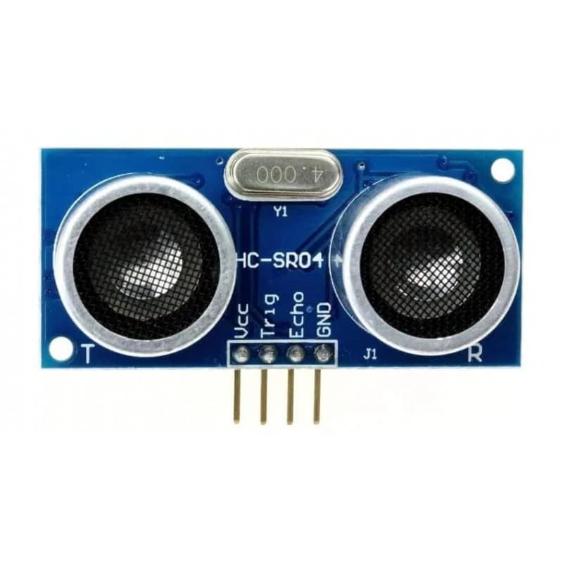
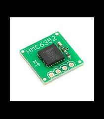
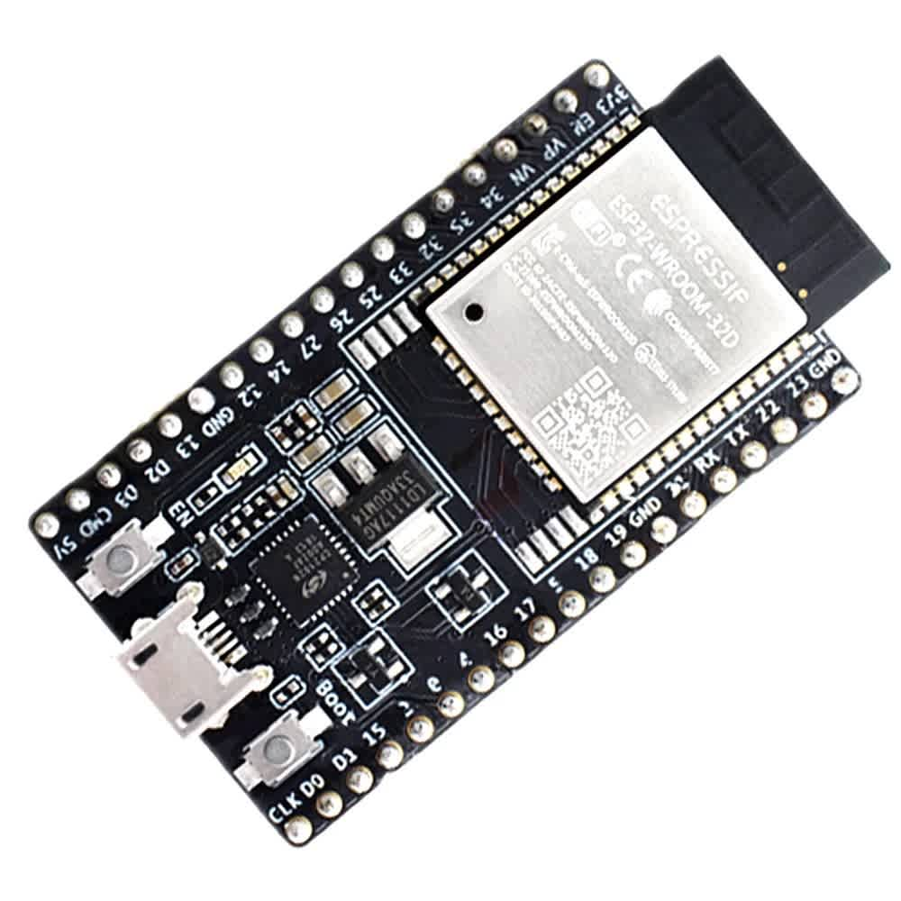
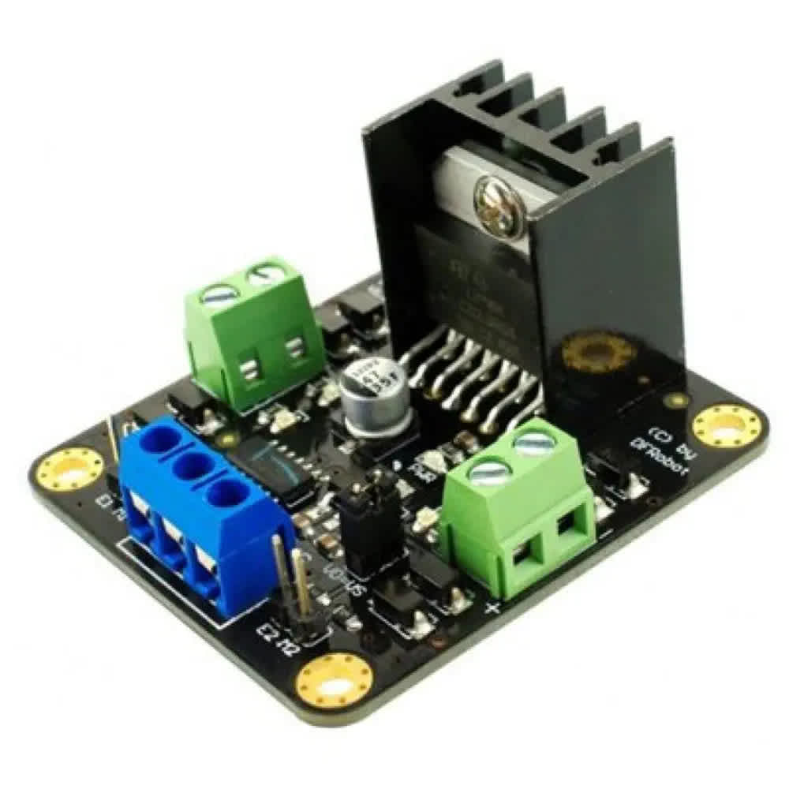
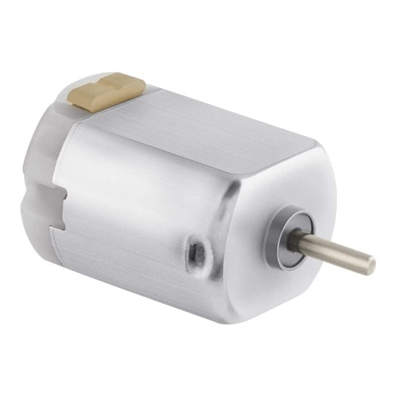
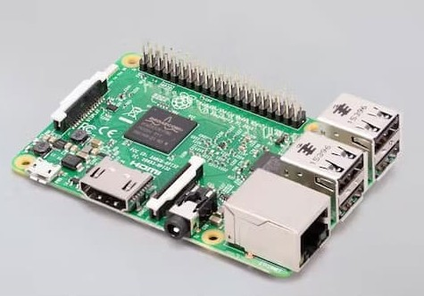
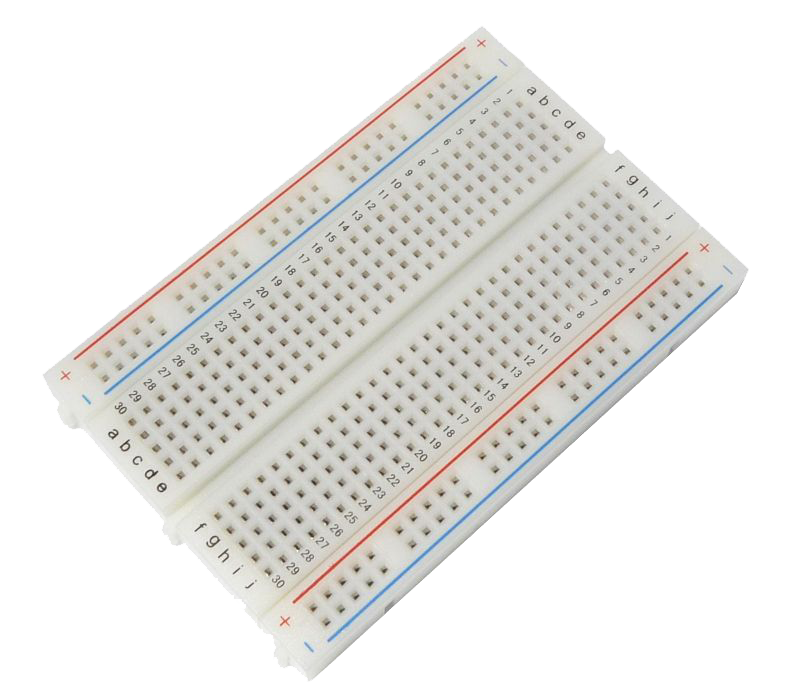
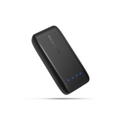
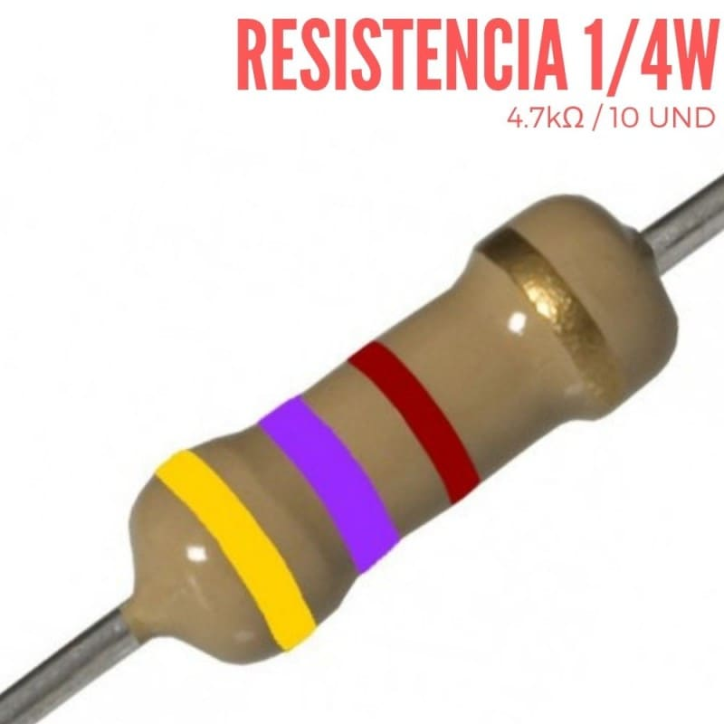
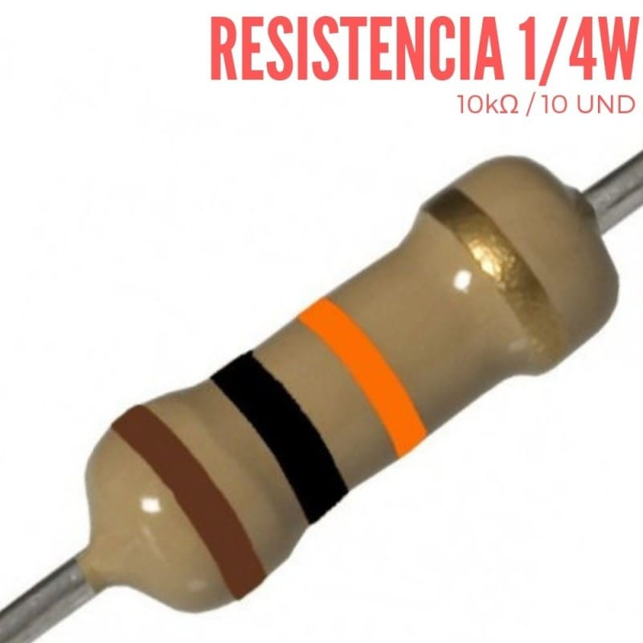

# Compa-Compra 🛒🤖

An autonomous shopping assistant that makes your shopping experience easier and smarter.

## What is it?

Compa-Compra is a general-purpose autonomous shopping assistant that guides and assists store users to complete their shopping easily and simply. Users communicate with ComCom through a dedicated application where they can specify products, and the system provides intelligent assistance throughout their shopping journey.

## Table of Contents

- [Hardware](#hardware)
  - [Components](#components)
  - [Connection Diagram](#connection-diagram)
  - [Assembly Instructions](#assembly-instructions)
- [Software](#software)
  - [Software Architecture](#software-architecture)
  - [Requirements and Languages](#requirements-and-languages)
  - [Algorithms](#algorithms)
- [Results](#results)
  - [Videos](#videos)
  - [Contributions](#contributions)
- [Authors](#authors)

## Hardware

### Components

The Compa-Compra system consists of the following hardware components:

<table>
  <tr>
    <td align="center">
      
      <p><strong>Sensor Distancia HC-SR04</strong><br/>
      Cantidad: 3<br/>
    </td>
    <td align="center">
      
      <p><strong>Sensor Brújula HMC6352</strong><br/>
      Cantidad: 1<br/>
    </td>
    <td align="center">
      
      <p><strong>Controladores ESP32</strong><br/>
      Cantidad: 5<br/>
    </td>
  </tr>
  <tr>
    <td align="center">
      
      <p><strong>Controlador de motor DF-MDV1.4</strong><br/>
      Cantidad: 1<br/>
    </td>
    <td align="center">
      
      <p><strong>Motor DC</strong><br/>
      Cantidad: 2<br/>
    </td>
    <td align="center">
      
      <p><strong>Raspberry PI 3</strong><br/>
      Cantidad: 1<br/>
    </td>
  </tr>
  <tr>
    <td align="center">
      
      <p><strong>Protoboard</strong><br/>
      Cantidad: 2<br/>
    </td>
    <td align="center">
      
      <p><strong>PowerBank</strong><br/>
      Cantidad: 1<br/>
    </td>
    <td align="center">
      
      <p><strong>Resisténcia de 4.7K Ohms</strong><br/>
      Cantidad: 3<br/>
    </td>
  </tr>
  <tr>
    <td align="center">
      
      <p><strong>Resisténcia de 10K Ohms</strong><br/>
      Cantidad: 3<br/>
    </td>
    <td></td>
    <td></td>
  </tr>
</table>


### Connection Diagram

[Connetion Diagram](connection/Raspberry%20PI%20&%20ESP32-1.png)

### Assembly Instructions

1. **Step 1**: Assemble the 3D printed chassis components
2. **Step 2**: Mount the electronic components according to the connection diagram
3. **Step 3**: Install sensors and calibrate the system
4. **Step 4**: Test all connections and functionality

## Software

### Software Architecture

The Compa-Compra system follows a modular architecture:

```
+-----------------------------+           +-----------------------------+
|         App mòbil           |           |         Backend API         |
|-----------------------------|           |-----------------------------|
| - Interfície d’usuari       |           | - Rep la llista de compra   |
| - Llistat de productes      | --------> | - Base de dades de productes|
| - Preferències              | <-------- | - Mapes de la botiga        |
| - Selecció de productes     |   dades   | - Càlcul de la ruta òptima  |
+-----------------------------+           +-----------------------------+
         |
         | rep ruta
         v
+----------------------------------------------------------+ <--------- +----------------------+
|                 Sistema del robot                        |            |      Balises UWB     |
|----------------------------------------------------------|            |----------------------|
| - Rep la ruta del backend                                |            | - Senyals UWB        |
| - Navegació per la botiga (quadrícula)                   |            | - Permeten la        |
| - Execució de la ruta                                    |            |   trilateració       |
| - Trilateració UWB (posicionament en temps real)         |            +----------------------+
| - Sensors addicionals                                    |
|                                                          |
|   +------------------------+   +----------------------+  |
|   |   Mòdul de moviment    |   |  Mòdul d’evitació    |  |
|   |- Motors de desplaçament|   |   de col·lisions      |
|   |                        |   |  - 3 sensors HC      |  |
|   +------------------------+   +----------------------+  |
+----------------------------------------------------------+
```

### Requirements and Languages

#### Hardware Requirements
- **Microcontroller**: ESP32 & Raspberry 
- **Sensors**: HC-SR04
- **Power**: Powerbank of at least 2.5A Output and 5V Output

#### Software Requirements
- **Mobile App**: 
  - Android 5+
- **Robot System**:
  - Raspbian OS 32 bits

#### Programming Languages
- **Mobile Application**: Flutter/Dart
- **Robot Control**: C, Python, Arduino IDE, Dart
- **Backend Services**: Google Services, Google Cloud
- **Database**: Firebase
- **APIs**: 
  - [Natural Language](https://cloud.google.com/natural-language?hl=es)
  - [Speech-to-Text](https://cloud.google.com/speech-to-text/docs?hl=es-419)

### Algorithms

The system implements several key algorithms:

#### 1. Path Planning Algorithm
- **Purpose**: Optimal route calculation through store layout
- **Method**: A* & TSP
- **Input**: Store map, current position, target products
- **Output**: Optimized shopping route

#### 2. Product Recognition
- **Purpose**: Identify products and their locations
- **Method**: Sensors

#### 3. Navigation Control
- **Purpose**: Autonomous movement and obstacle avoidance
- **Method**: Trilateration and possitioning
- **Features**: Real-time obstacle detection and avoidance

## Results

### Videos

| Demo Type | Description | Link |
|-----------|-------------|------|
| Navigation + APP Demo | Autonomous navigation in store | [Watch Video](https://youtu.be/27P_5_Zp0pg) |

### Contributions

This project demonstrates:

- ✅ **Autonomous Navigation**: Successfully navigates store environments
- ✅ **User-Friendly Interface**: Intuitive mobile application
- ✅ **Real-time Communication**: Seamless robot-app integration
- ✅ **Efficient Path Planning**: Optimized shopping routes
- ✅ **Scalable Architecture**: Modular system design

## Authors

**Development Team:**
- Adrià Fernández Mata
- David Madueño Noguer
- Moisés Sánchez Pin
- Tiago Nunes Rodrigues
- Pol Tomé Garcia

---

## Getting Started

### Quick Setup
1. Clone this repository
2. Follow the [Hardware Assembly](#assembly-instructions) guide
3. Install the mobile application
4. Upload firmware to the robot system
5. Configure your store layout
6. Start shopping with ComCom! 🛒

---

*Made with ❤️ by the Compa-Compra team*